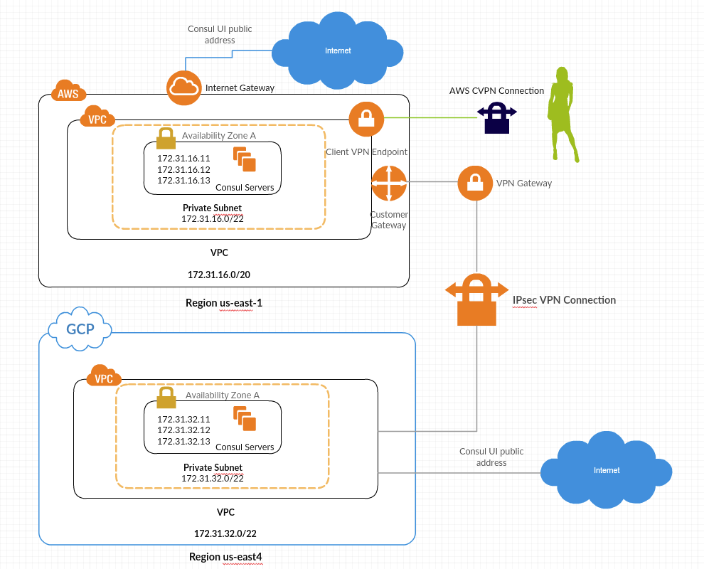

# This repo contains an example of GCP - AWS - Consul cluster deployment.



## AWS VPC
### [This module](https://github.com/chavo1/aws-vpc-terraform) will create VPC in AWS region "us-east-1"
## AWS Client VPN
### [This module](https://github.com/chavo1/client-vpn-aws-terraform) will create AWS Client VPN
## AWS EC2 (Consul servers)
### [This module](https://github.com/chavo1/aws-consul-terraform-multi-region) will create a needed number of Consul server in AWS
## AWS IPsec VPN
### [This module](https://cloud.google.com/) will create a VPN connection between AWS and GCP.
## GCP VPC
### [This module](https://github.com/chavo1/gcp-vpc) will create VPC in GCP region "us-east4"
## GCP Site to Site
### [This module](https://github.com/chavo1/gcp-aws-vpn-common) will create GCP Site to Site VPN
## GCP compute (Consul servers)
### [This module](https://github.com/chavo1/gcp-consul) will create a needed number of Consul server in GCP
## Prerequisites

- [Terraform](https://www.terraform.io/downloads.html)
- [AWS Account](https://aws.amazon.com/account/)
- Basic [Consul](https://www.consul.io/) knowledge
- [GCP Account](https://aws.amazon.com/account/)

### Prepare you own AWS AMIs with [Packer](https://www.packer.io/)
- AWS [PACKER-CONSUL-SERVER](https://github.com/chavo1/packer-consul-server)

### Prepare you own GCP Image with [Packer](https://www.packer.io/)
- GCP [PACKER-CONSUL-SERVER](https://github.com/chavo1/packer-consul-server-gcp)

### Clone the repo
```
git clone https://github.com/chavo1/gcp-aws-vpn-consul-terraform.git
cd gcp-aws-vpn-consul-terraform
terraform init
terraform apply
```
- After the deployment Terraform will generate a file into the root directory "config-cvpn.ovpn". So you can use it to connect to the environment in both DCs with [AWS Client VPN](https://docs.aws.amazon.com/vpn/latest/clientvpn-admin/what-is.html). 
- VPN client depend on your choice, in my case I use [tunnelblick](https://tunnelblick.net/).

### To test you will need Kitchen:

- Kitchen provides a test harness to execute infrastructure code on one or more platforms in isolation.
- Install [kitchen.ci](https://kitchen.ci/)

Than simply execute a following commands:
```
bundle exec kitchen converge
bundle exec kitchen verify
bundle exec kitchen destroy
```
