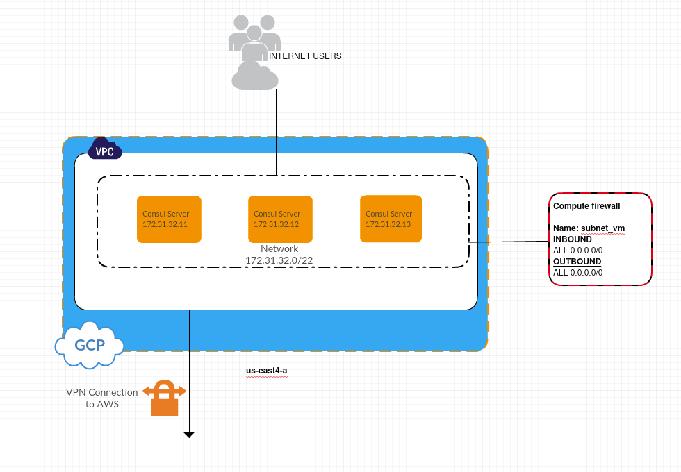

# This repo contains an example of GCP - AWS - Consul cluster deployment.



## GCP VPC

### [This module](https://github.com/chavo1/gcp-vpc) will create VPC in GCP region "us-east4"

## GCP Site to Site

### [This module](https://github.com/chavo1/gcp-aws-vpn) will create GCP Site to Site VPN

## GCP compute (Consul servers)

### [This module](https://github.com/chavo1/gcp-consul) will create a needed number of Consul server in GCP

## Prerequisites

- [Terraform](https://www.terraform.io/downloads.html)
- Basic [Consul](https://www.consul.io/) knowledge
- [GCP Account](https://aws.amazon.com/account/)

### Prepare you own AWS AMIs with [Packer](https://www.packer.io/)
- AWS [PACKER-CONSUL-SERVER](https://github.com/chavo1/packer-consul-server)

### Prepare you own GCP Image with [Packer](https://www.packer.io/)
- GCP [PACKER-CONSUL-SERVER](https://github.com/chavo1/packer-consul-server-gcp)

### Clone the repo
```
git clone https://github.com/chavo1/gcp-aws-vpn-consul-terraform.git
cd gcp-aws-vpn-consul-terraform/gcp-env
terraform init
terraform apply
```
### To test you will need Kitchen:

- Kitchen is a RubyGem so please find how to install and setup Test Kitchen for developing infrastructure code, check out the [Getting Started Guide](http://kitchen.ci/docs/getting-started/).
For more information about tests please check the next link:

Than simply execute a following commands:

```
bundle exec kitchen converge
bundle exec kitchen verify
bundle exec kitchen destroy
```
- The result should as follow:
```
  Command: `terraform state list`
     ✔  stdout should include "module.consul_servers.google_compute_instance.server[0]"
     ✔  stderr should include ""
     ✔  exit_status should eq 0
  HTTP GET on http://35.230.164.70:8500/ui/aws_virginia/services
     ✔  status should cmp == 200
  HTTP GET on http://35.230.164.70:8500/ui/aws_virginia/nodes
     ✔  status should cmp == 200
  HTTP GET on http://35.230.164.70:8500/ui/aws_virginia/services/web
     ✔  status should cmp == 200

Test Summary: 6 successful, 0 failures, 0 skipped
```